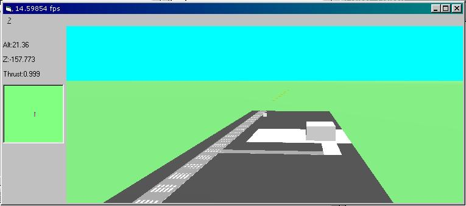



## FlightSim2

### Description

This is a new submit. With the other one the Direct3D RMControl was not included.
 
### More Info
 

             |
---                |---
**Submitted On**   |2000-10-22 18:55:32
**By**             |[Filip](https://github.com/Planet-Source-Code/PSCIndex/blob/master/ByAuthor/filip.md)
**Level**          |Advanced
**User Rating**    |4.7 (28 globes from 6 users)
**Compatibility**  |VB 6\.0
**Category**       |[DirectX](https://github.com/Planet-Source-Code/PSCIndex/blob/master/ByCategory/directx__1-44.md)
**World**          |[Visual Basic](https://github.com/Planet-Source-Code/PSCIndex/blob/master/ByWorld/visual-basic.md)
**Archive File**   |[CODE\_UPLOAD1087010222000\.zip](https://github.com/Planet-Source-Code/filip-flightsim2__1-12227/archive/master.zip)

